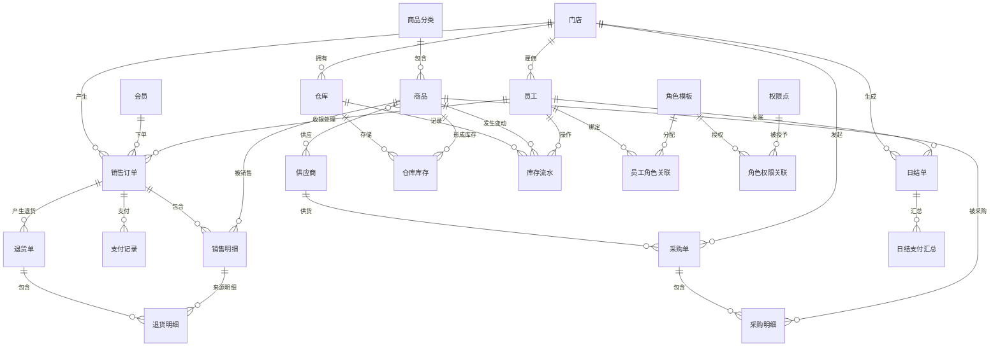

# 第一阶段任务：超市管理系统逻辑数据模型（代码 + ORM）

## 1. 建模说明

本模型基于项目当前技术栈 `FastAPI + Tortoise ORM + MySQL`，通过实体类定义逻辑数据模型。  
对应代码文件：`app/models/supermarket_phase1.py`。

建模目标：
- 覆盖第一期工程核心业务：商品、会员、员工、销售、仓储、财务、系统权限。
- 预留第二期扩展：采购与供应协同。
- 明确量词关系（1:1 / 1:N / N:N）。
- 提供抽象层次关系（抽象父类 -> 具体实体）。

---

## 2. 抽象层次关系（泛化）

抽象层次通过 `Party` 实体表达：
- `Party`（抽象，不落表业务明细）定义通用属性：`party_code`、`party_name`、`phone`、`status`。
- `Member` 继承 `Party`：用于会员管理。
- `Employee` 继承 `Party`：用于员工管理。
- `Supplier` 继承 `Party`：用于供应商管理。

说明：这是“抽象层次关系”的代码实现，体现“同类对象共性上提，个性下沉”。

---

## 3. 量词关系（基数关系）

### 3.1 1:N 关系

- `Store (1) -> (N) Employee`
- `Store (1) -> (N) SalesOrder`
- `Store (1) -> (N) DailySettlement`
- `SalesOrder (1) -> (N) SalesOrderItem`
- `SalesOrder (1) -> (N) PaymentRecord`
- `ReturnOrder (1) -> (N) ReturnOrderItem`
- `Warehouse (1) -> (N) WarehouseStock`
- `PurchaseOrder (1) -> (N) PurchaseOrderItem`

### 3.2 N:N 关系

- `Product (N) <-> (N) Supplier`（中间表：`sm_product_supplier`）
- `Employee (N) <-> (N) RoleTemplate`（中间实体：`EmployeeRole`）
- `RoleTemplate (N) <-> (N) Permission`（中间实体：`RolePermission`）

### 3.3 1:1 / 唯一约束关系（逻辑上）

- `Store + business_date` 在 `DailySettlement` 中唯一，保证“每店每日唯一日结”。
- `warehouse_id + product_id` 在 `WarehouseStock` 中唯一，保证“仓库商品库存唯一行”。

---

## 4. 一期模型覆盖清单

### 商品管理模块
- `ProductCategory`
- `Product`

### 会员管理模块
- `Member`

### 员工管理模块
- `Employee`

### 销售管理模块
- `SalesOrder`
- `SalesOrderItem`
- `PaymentRecord`
- `ReturnOrder`
- `ReturnOrderItem`

### 供应管理模块（一期预留，二期可直接扩展）
- `Supplier`
- `PurchaseOrder`
- `PurchaseOrderItem`

### 仓库管理模块
- `Warehouse`
- `WarehouseStock`
- `StockMovement`

### 财务管理模块
- `DailySettlement`
- `DailySettlementPayment`

### 系统管理模块（业务权限侧）
- `RoleTemplate`
- `Permission`
- `EmployeeRole`
- `RolePermission`

---

## 5. ER 关系图（Mermaid）

---

## 6. 关键约束与业务规则落地

- 唯一性约束：
  - 商品编码、条码唯一。
  - 会员号、员工号、供应商号唯一。
  - `DailySettlement(store_id, business_date)` 唯一。
- 追溯性约束：
  - 库存变化通过 `StockMovement` 记录业务单号与前后数量。
- 可扩展性：
  - 一期闭环可覆盖“商品 -> 销售 -> 库存 -> 日结”。
  - 二期可在采购单基础上扩展收货、应付对账、调拨流程。

---

## 7. 与提交要求对照

- 要求1（一期模型完整性）：已覆盖各模块核心实体，并保留二期采购扩展。
- 要求2（代码 + ORM）：采用 Tortoise ORM 实体类建模，已落地在代码文件。
- 要求2（量词关系）：文档与模型均体现 1:N、N:N、唯一约束关系。
- 要求2（抽象层次）：`Party -> Member/Employee/Supplier` 已实现。
- 要求3（PPT讲解）：见 `docs/第一期-数据建模汇报PPT.md`。
