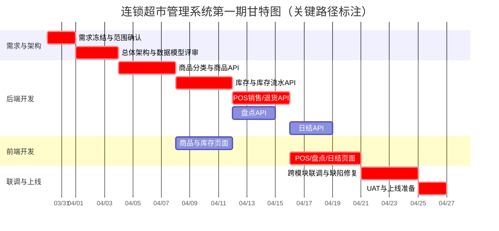
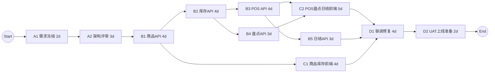
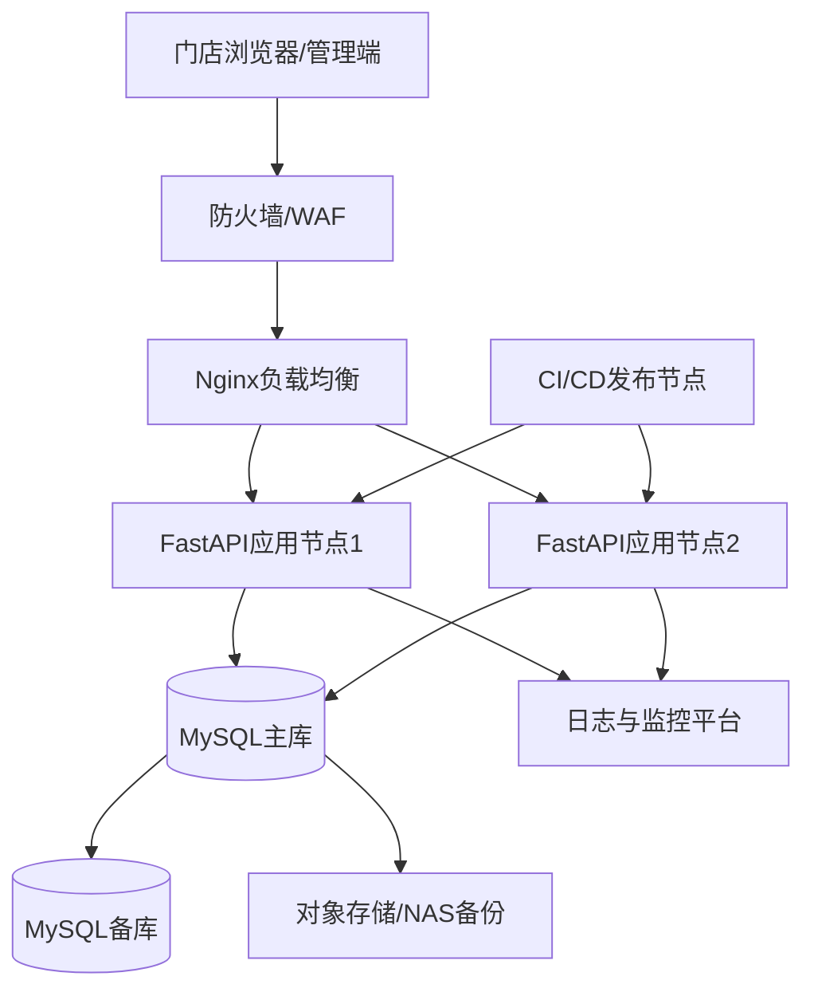

# 连锁超市管理系统（第一期）项目计划与技术方案报告

## 1. 目标与范围

本报告面向第一期工程（商品管理、门店库存、收银POS、盘点、日结），交付以下材料：

1. 任务分解结构列表（WBS）
2. 带关键路径的甘特图与PERT图，并给出软件开发时间表
3. 硬件架构方案
4. 网络架构方案（含拓扑图）
5. 软件架构方案（技术选型与理由）
6. 实施方案（测试到生产转换、代码与数据交付方式）

***

## 2. 任务分解结构列表（WBS）

### 2.1 一级任务

- 1.0 项目管理与需求冻结
- 2.0 后端核心能力建设
- 3.0 前端业务页面建设
- 4.0 集成测试与验收上线

### 2.2 二级任务（可直接用于任务看板）

| WBS编码 | 任务名称            | 工期（工作日） | 前置任务        | 责任角色     | 交付物            |
| ----- | --------------- | ------: | ----------- | -------- | -------------- |
| 1.1   | 需求冻结与范围确认       |       2 | -           | 系统分析师/产品 | 需求冻结清单、验收口径    |
| 1.2   | 总体架构与数据模型评审     |       3 | 1.1         | 架构师/后端   | 架构说明、ER与接口草案   |
| 2.1   | 商品分类与商品API开发    |       4 | 1.2         | 后端       | 商品域接口可用        |
| 2.2   | 库存与库存流水API开发    |       4 | 2.1         | 后端       | 库存查询与流水追溯接口    |
| 2.3   | POS销售/退货API开发   |       4 | 2.2         | 后端       | 销售、支付、退货接口     |
| 2.4   | 盘点API开发         |       3 | 2.2         | 后端       | 盘点单、差异、确认接口    |
| 2.5   | 日结API开发         |       3 | 2.3,2.4     | 后端       | 日结汇总与关账接口      |
| 3.1   | 商品与库存前端页面开发     |       4 | 2.1         | 前端       | 商品页、库存余额页、流水页  |
| 3.2   | POS/盘点/日结前端页面开发 |       5 | 2.3,2.4     | 前端       | 收银台、盘点页、日结页    |
| 4.1   | 跨模块联调与缺陷修复      |       4 | 2.5,3.1,3.2 | 前后端/测试   | 联调通过、缺陷关闭清单    |
| 4.2   | UAT与上线准备        |       2 | 4.1         | 全员       | 验收报告、上线清单、回滚预案 |

***

## 3. 甘特图（含关键路径）

说明：关键路径在图中以 `crit` 标识，关键路径总工期为 **28个工作日**。

***

## 4. PERT图与软件开发时间表

### 4.1 PERT图（关键路径）

关键路径：**A1 → A2 → B1 → B2 → B3 → C2 → D1 → D2**\
关键路径工期：**28工作日**

### 4.2 软件开发时间表（基线计划）

| 任务            | 开始日期       | 结束日期       | 工期（工作日） | 备注       |
| ------------- | ---------- | ---------- | ------: | -------- |
| 需求冻结与范围确认     | 2026-03-30 | 2026-03-31 |       2 | 形成冻结版本   |
| 总体架构与数据模型评审   | 2026-04-01 | 2026-04-03 |       3 | 接口契约评审   |
| 商品分类与商品API    | 2026-04-06 | 2026-04-09 |       4 | 含分类与状态管理 |
| 库存与库存流水API    | 2026-04-10 | 2026-04-15 |       4 | 含预警查询    |
| POS销售/退货API   | 2026-04-16 | 2026-04-21 |       4 | 含库存联动    |
| 盘点API         | 2026-04-16 | 2026-04-20 |       3 | 与POS并行   |
| 日结API         | 2026-04-22 | 2026-04-24 |       3 | 依赖POS与盘点 |
| 商品与库存前端页面     | 2026-04-10 | 2026-04-15 |       4 | 与后端并行推进  |
| POS/盘点/日结前端页面 | 2026-04-22 | 2026-04-28 |       5 | 关键链路页面   |
| 跨模块联调与缺陷修复    | 2026-04-29 | 2026-05-04 |       4 | 质量门禁     |
| UAT与上线准备      | 2026-05-05 | 2026-05-06 |       2 | 发布与回滚检查  |

***

## 5. 硬件架构方案

### 5.1 目标规模（第一期）

- 门店规模：1\~10家
- 并发规模：峰值在线 100\~300 用户
- 数据规模：商品/库存/流水/订单在课程与试运行阶段为中小规模

### 5.2 硬件配置建议

| 环境   | 节点角色    | 建议配置                          |   数量 | 说明          |
| ---- | ------- | ----------------------------- | ---: | ----------- |
| 开发环境 | 开发机     | 8核CPU / 16GB内存 / 512GB SSD    |  按人配 | 前后端本地开发与调试  |
| 测试环境 | 应用服务器   | 8核CPU / 16GB内存 / 200GB SSD    |    1 | 承载UAT与接口联调  |
| 测试环境 | 数据库服务器  | 8核CPU / 16GB内存 / 500GB SSD    |    1 | 独立库便于压测与回归  |
| 生产环境 | 网关/反向代理 | 4核CPU / 8GB内存 / 100GB SSD     |    1 | Nginx/SSL终止 |
| 生产环境 | 应用服务器   | 8核CPU / 16GB内存 / 200GB SSD    |    2 | 主备或双节点负载均衡  |
| 生产环境 | 数据库服务器  | 8\~16核CPU / 32GB内存 / NVMe SSD | 1主1备 | 保证事务与查询性能   |
| 生产环境 | 备份存储    | 2TB对象存储或NAS                   |    1 | 数据与日志备份     |

### 5.3 选型理由

- 前后端分离架构下，应用与数据库分离部署有利于性能隔离与故障定位
- 双应用节点可提升可用性，支撑后续门店扩展
- NVMe与独立备份存储可降低高并发写入和数据恢复风险

***

## 6. 网络架构方案

### 6.1 网络分区建议

- **接入区（DMZ）**：负载均衡/反向代理
- **应用区（内网）**：FastAPI应用节点
- **数据区（内网隔离）**：MySQL实例与备份存储
- **运维区（管控）**：日志、监控、CI/CD访问入口

### 6.2 网络拓扑图

### 6.3 网络方案理由

- 外网仅暴露网关，应用与数据库不直接对外，降低攻击面
- 数据库主备与定时备份结合，提高故障恢复能力
- 通过统一日志与监控，支持发布后快速定位问题

***

## 7. 软件架构方案

### 7.1 技术选型

| 分层    | 技术栈                                                 | 选型理由                  |
| ----- | --------------------------------------------------- | --------------------- |
| 前端    | Vue3 + Vite + Naive UI + Pinia + Vue Router + Axios | 组件化成熟、开发效率高、适合中后台业务   |
| 后端    | FastAPI + Pydantic + Tortoise ORM + Uvicorn         | 高性能异步接口、类型校验完善、开发效率高  |
| 鉴权与权限 | JWT + RBAC + 动态路由                                   | 与现有系统一致，支持菜单与按钮级权限控制  |
| 数据库   | MySQL（`asyncmy` 驱动）                                 | 事务能力强，适合订单/库存等结构化数据   |
| 迁移工具  | Aerich                                              | 与Tortoise配套，便于演进数据库结构 |
| 构建发布  | Docker + Nginx                                      | 环境一致性好，便于标准化交付        |

### 7.2 与当前仓库一致性说明

- 后端核心依赖已在 `pyproject.toml` 中定义（FastAPI、Tortoise ORM、Pydantic、Uvicorn、asyncmy）
- 前端核心依赖已在 `web/package.json` 中定义（Vue3、Vite、Naive UI、Pinia、Vue Router、Axios）
- 项目定位为 FastAPI + Vue3 的前后端分离管理系统

### 7.3 软件架构分层

- **表示层**：Web前端（商品、库存、POS、盘点、日结页面）
- **接口层**：REST API（按模块拆分路由）
- **领域层**：商品域、库存域、销售域、盘点域、日结域
- **数据层**：MySQL业务库 + 审计日志 + 备份

***

## 8. 实施方案（可选）

### 8.1 环境切换策略（测试 -> 生产）

- 使用环境变量区分 `dev/test/prod` 配置（数据库连接、域名、日志级别）
- 发布前执行版本冻结：代码Tag、数据库迁移脚本冻结、接口文档冻结
- UAT通过后，按“灰度->全量”发布，出现异常按回滚预案恢复

### 8.2 代码交付形式

- 交付物：Git仓库Tag + Docker镜像版本号 + 发布说明（变更点、风险点、回滚步骤）
- 发布路径：CI/CD从Tag构建镜像，推送制品库后部署到生产环境

### 8.3 数据交付与数据转换

- 交付内容：基础主数据（商品分类、商品、门店、员工）初始化脚本
- 转换方式：历史Excel/CSV通过ETL脚本导入（字段映射、编码校验、重复校验）
- 切换策略：先全量导入、后增量同步，最终切换窗口只处理增量差异

### 8.4 质量与验收门禁

- API回归通过率 >= 95%
- 核心流程（建档->销售->库存->盘点->日结）端到端通过
- 关键接口响应时间满足第一期性能目标

***

## 9. 结论

- 第一期开工到上线准备的基线周期为 **28个工作日**，关键路径已明确，可直接作为排期依据。
- 技术方案与当前仓库技术栈保持一致，具备低改造成本和可持续扩展能力。
- 通过“分区网络 + 双节点应用 + 主备数据库 + 标准化发布流程”，可满足课程项目与小规模试运行要求。

