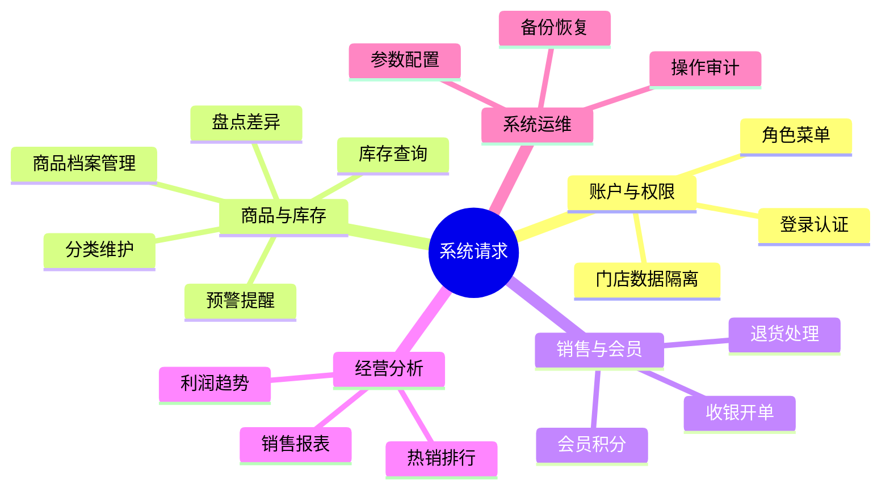
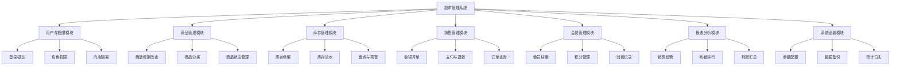

# 超市管理系统初步调查报告（前端负责版）

## 1. 文档目的与范围

本报告用于课程作业阶段的“初步调查”交付，聚焦前端团队可落地的需求边界与实施依据，覆盖：

- 收集整理的系统请求（会议纪要 + 请求清单）
- 超市管理系统功能模块图
- 可行性评估报告
- 功能优先级报告

系统定位为连锁超市场景下的门店经营管理平台，采用 Web 模式，支持角色登录后按权限完成商品、库存、销售、会员与报表等业务操作。

## 2. 调查方法与信息来源

### 2.1 调查方法

- 业务访谈：与店长、收银员、仓管、财务代表进行场景访谈
- 原型走查：按“登录->商品->销售->库存->报表”链路逐步确认页面需求
- 现状对比：对比人工台账流程与系统化流程，识别效率和错误率问题
- 可行性分析：从技术、经济、安全、组织四个维度评估上线可行性

### 2.2 角色样本

- 店长（经营与盘点负责人）
- 收银员（销售执行）
- 仓管（入库、出库、库存盘点）
- 财务/经理（利润汇总、预算与绩效查看）
- 顾客/会员（信息查看、积分与活动）

## 3. 收集整理的系统请求

### 3.1 需求沟通会议记录（节选）

| 会议项 | 内容 |
| --- | --- |
| 会议主题 | 超市管理系统初步需求澄清会 |
| 参会角色 | 店长、收银员、仓管、财务代表、前端负责人 |
| 当前痛点 | 手工统计耗时、库存误差高、销售/退货对账困难、信息查询慢 |
| 目标共识 | 建立商品-库存-销售-盘点-日结闭环，支持门店级权限隔离 |
| 前端关注点 | 页面易用、查询快、操作可追溯、不同角色菜单清晰 |
| 结论 | 第一阶段优先交付商品管理、库存管理、销售管理核心页面 |

### 3.2 系统请求清单（按业务归类）

| 请求编号 | 请求内容 | 来源角色 | 前端交付形态 | 优先级 |
| --- | --- | --- | --- | --- |
| SR-01 | 账号登录并按角色进入不同功能菜单 | 全员 | 登录页、动态菜单、权限提示 | P0 |
| SR-02 | 商品信息增删改查、分类管理 | 店长/仓管 | 商品列表页、编辑弹窗、分类管理页 | P0 |
| SR-03 | 实时库存查询、低库存预警 | 店长/仓管 | 库存看板页、预警高亮、筛选区 | P0 |
| SR-04 | 销售收银、退货处理、打印小票 | 收银员 | 收银台页面、订单详情、退货流程页 | P0 |
| SR-05 | 盘点录入与差异确认 | 店长/仓管 | 盘点任务页、差异确认页 | P1 |
| SR-06 | 会员信息与积分查询 | 收银员/顾客 | 会员中心页、积分明细页 | P1 |
| SR-07 | 销售报表、热销排行、趋势分析 | 店长/经理 | 报表看板页、图表筛选组件 | P1 |
| SR-08 | 系统参数设置与数据备份入口 | 管理员 | 系统设置页、操作记录页 | P2 |
| SR-09 | 员工绩效查看与状态管理 | 经理 | 人员绩效页、状态切换页 | P2 |

### 3.3 请求结构图（前端视角）

## 4. 超市管理系统功能模块图

## 5. 可行性评估报告

### 5.1 技术可行性（高）

- 前端技术栈已具备：Vue3 + Vite + 组件化结构，支持快速搭建管理端页面
- 后端接口能力明确：可通过 REST API 对接商品、库存、销售等模块
- 复杂度可控：首期按门店级业务闭环拆分，先满足核心运营，再逐步扩展
- 页面实现路径清晰：CRUD 页、表单弹窗、表格筛选、图表看板均为成熟实现模式

结论：前端侧技术可行，风险主要在跨模块联调和权限细节，属于可管理风险。

### 5.2 经济可行性（高）

- 使用现有开发环境和开源框架，无新增许可成本
- 首期聚焦高价值核心流程，投入产出比更高
- 通过系统替代人工台账，减少重复录入和对账成本

结论：课程项目与中小超市场景下均具备良好经济可行性。

### 5.3 安全与运维可行性（中高）

- 支持账号密码登录、角色权限控制、门店数据隔离
- 关键操作保留日志与操作人信息，便于追溯
- 可规划数据备份与恢复入口，降低误操作损失

结论：具备基础安全能力，建议在后续阶段完善审计告警与异常监控。

### 5.4 组织与实施可行性（高）

- 角色职责清晰：店长、收银员、仓管、财务按模块分工明确
- 前后端可并行：前端先基于接口契约完成页面骨架，后续联调补齐细节
- 分阶段交付：先核心功能，后报表与系统设置，减少一次性复杂度

结论：组织实施可行，建议采用周迭代评审机制。

## 6. 优先级报告（前端实施排序）

### 6.1 分级标准

- P0：必须上线，直接影响营业闭环
- P1：重要增强，影响管理效率
- P2：优化功能，影响长期治理能力

### 6.2 优先级矩阵

| 模块 | 用户价值 | 实现复杂度 | 优先级 | 说明 |
| --- | --- | --- | --- | --- |
| 登录与权限菜单 | 高 | 中 | P0 | 先解决可用与越权问题 |
| 商品管理 | 高 | 中 | P0 | 营业前提，支撑收银检索 |
| 库存查询与预警 | 高 | 中 | P0 | 防止缺货和错卖 |
| 收银与退货 | 高 | 中高 | P0 | 营业核心，直接影响收入 |
| 盘点管理 | 中高 | 中高 | P1 | 提升库存准确率 |
| 会员管理 | 中 | 中 | P1 | 提升复购与用户粘性 |
| 报表分析 | 中高 | 中高 | P1 | 支持经营决策 |
| 系统设置与备份入口 | 中 | 中 | P2 | 偏运维管理能力 |
| 员工绩效管理 | 中 | 中 | P2 | 管理优化，非首期阻断 |

### 6.3 前端里程碑建议

| 迭代阶段 | 前端交付重点 |
| --- | --- |
| 第一阶段 | 登录鉴权、菜单权限、商品管理、库存页 |
| 第二阶段 | 收银台、退货、盘点流程 |
| 第三阶段 | 会员中心、报表看板、系统设置 |

## 7. 前端范围说明（你负责部分）

### 7.1 明确负责内容

- 页面与交互：列表、查询、表单、详情、状态流转
- 权限感知：菜单可见性、按钮级权限、无权限提示
- 数据展示：销售与库存图表、统计卡片、预警高亮
- 易用性设计：收银流程最短路径、关键操作二次确认

### 7.2 与后端协同边界

- 以前后端接口契约为准，不在前端实现业务真规则判定
- 所有关键校验以服务端为准，前端负责输入约束与提示体验
- 统一错误码处理，保证用户可理解的反馈文案

## 8. 初步结论

- 超市管理系统建设必要性明确，核心目标是提高经营效率、降低人工错误、增强可追溯性。
- 从前端视角，项目具备较高落地可行性，建议按 P0->P1->P2 分阶段推进。
- 首期应优先保证“登录权限 + 商品 + 库存 + 销售”闭环可演示，再逐步补齐盘点、会员和报表能力。
